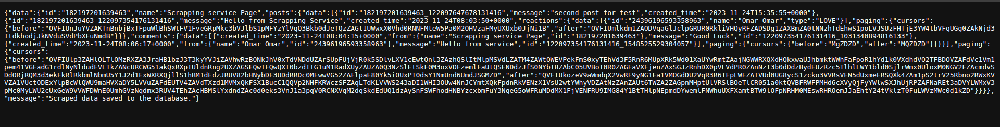
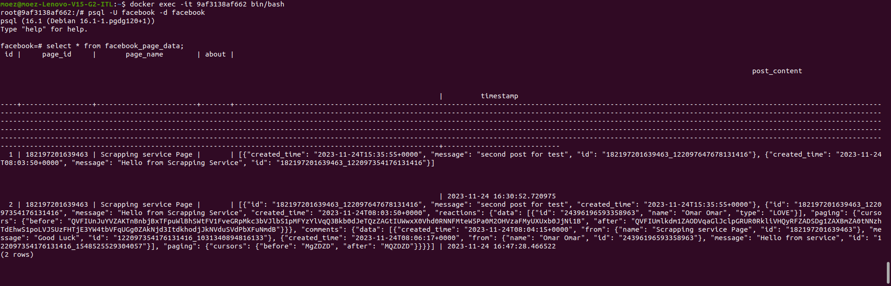
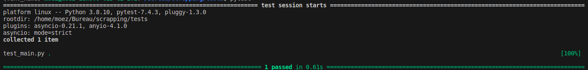

# Scrapping Service

## Overview

This project implements a Facebook scrapping service using FastAPI to retrieve data from one public page. The scrapping data is saved in a PostgreSQL database. Both the service and the database are dockerized for easy deployment using `docker-compose.yaml`. Additionally, a test is included to ensure the functionality of the scrapping service.

## Features

- Facebook scrapping using FastAPI.
- Database storage for scrapping data.
- Dockerized service and database.
- Included test for scrapping service.

## Prerequisites

- Docker installed on your machine.
- Python 3.7 or later installed on your machine.

## Build Facebook (1 public page)

- For this step, create a Facebook page named [Scrapping Service Page](https://www.facebook.com/profile.php?id=61553942488650) for the `PAGE_ID`. Then, create a developer's Facebook account and a [Graph API application](https://developers.facebook.com/docs/graph-api/) for the `ACCESS_TOKEN`.

## Save Scrapping Data

- Create an `app` directory for this step with three files (`db`, `main`, and `scraper`).

    
    *The data in the browser URL [http://172.18.0.1/scrape](http://172.18.0.1/scrape)*

    
    *Data in the database*

## Dockerization

- This step includes a Dockerfile for the FastAPI service and a docker-compose file for the two containers. Use a `.env` file to secure sensitive data.

## Test

- A simple test to assert that the data is exposed correctly on the browser.

    
    *Test the service*
